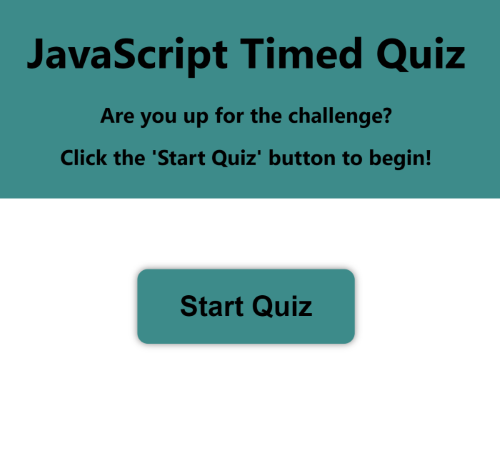
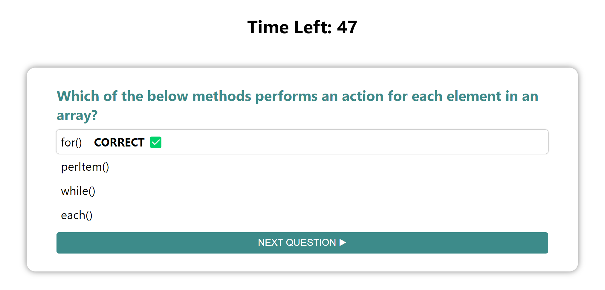
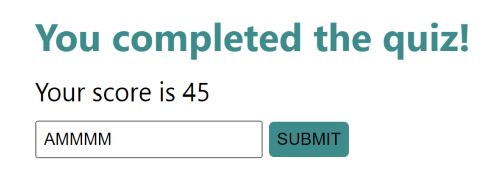
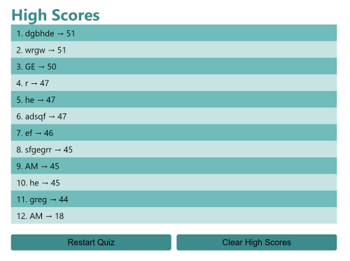

# Timed Quiz Using JavaScript

## Description

During technical interviews for coding positions, candidates are often given multiple choice questions to answer and/or coding challenges. This Javascript coding quiz was created to combine these 2 aspects of a technical interview by using the skills I have learned, such as, dynamic generation of HTML and CSS using Javascript.

## Installation

N/A

## Usage

The deployed application can be found [here](https://amaragh.github.io/javascript-quiz/).

I used several HTML, CSS, Javascript and Web API features to execute the delivery of this quiz. A few examples are listed below:
- buttons to assist with progression through the quiz
- HTML class to affect hiding or showing a section on the web application
- CSS pseudoclasses for more interactive effects for the user
- event listeners to trigger specific actions when certain objects are clicked
- localStorage to save a running list of high scores

Below are some screenshots of the application in different phases.

This is the start of the quiz, and once the user clicks the 'Start Quiz' button, the first question appears, and the timer begins.

This is a sample question which has been answered. Depending on the selected response, the row of the response will indicate whether the answer is correct or incorrect. The button to go to the next question only appears once a question has been answered. The timer is also displayed at the top of the page.

This page allows the user to save their score once the quiz has ended.

Once the user submits their score, they are directed to the final list of high scores. The position of the user's score will appear in relation to the other scores, i.e., the list of scores will be sorted from highest to lowest. The user can then decide to retake the quiz or clear the stored high scores.

## Credits

N/A

## License

Please refer to the license in the repo.